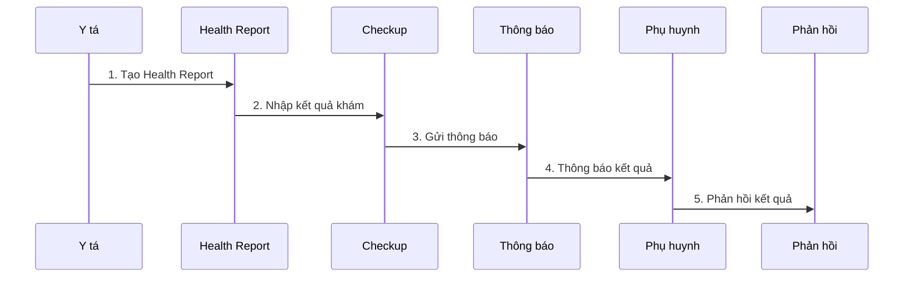
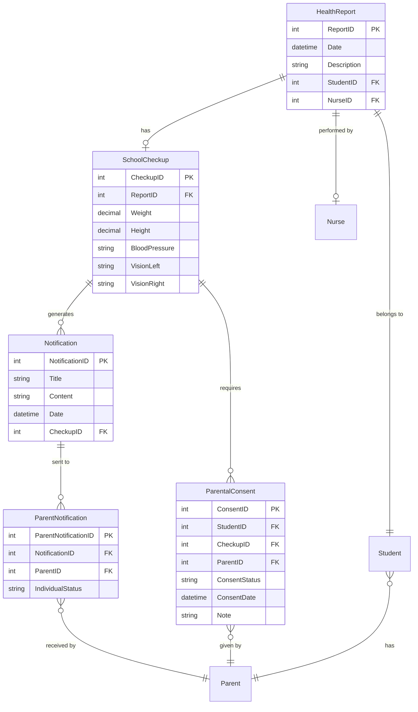

# Hướng dẫn sử dụng API Checkup

## Quy trình làm việc

Quy trình khám sức khỏe trong hệ thống bao gồm các bước sau:

1. **Y tá tạo Health Report**: Y tá tạo một báo cáo sức khỏe cơ bản cho học sinh
2. **Y tá nhập kết quả khám**: Y tá nhập các thông số sức khỏe chi tiết (chiều cao, cân nặng, huyết áp, thị lực)
3. **Hệ thống gửi thông báo**: Phụ huynh nhận được thông báo về kết quả khám
4. **Phụ huynh xem kết quả**: Phụ huynh xem chi tiết kết quả khám của con
5. **Phụ huynh phản hồi**: Phụ huynh có thể đồng ý hoặc từ chối kết quả khám

## Sơ đồ luồng quy trình



## Cấu trúc cơ sở dữ liệu



## Quy trình tạo kết quả khám sức khỏe

Để tạo một kết quả khám sức khỏe (checkup) cho học sinh, bạn cần thực hiện theo các bước sau:

### Bước 1: Tạo Health Report

Đầu tiên, bạn cần tạo một Health Report cho học sinh:

```
POST /api/checkup/reports
```

Body:
```json
{
  "date": "2023-07-20T10:00:00",  // Ngày khám (tùy chọn, mặc định là ngày hiện tại)
  "description": "Khám sức khỏe định kỳ",
  "studentID": 1,  // ID của học sinh
  "nurseID": 2     // ID của y tá (tùy chọn)
}
```

Kết quả trả về sẽ bao gồm `reportID` mà bạn sẽ cần cho bước tiếp theo:

```json
{
  "reportID": 123,
  "date": "2023-07-20T10:00:00",
  "description": "Khám sức khỏe định kỳ",
  "studentID": 1,
  "studentName": "Nguyễn Văn A",
  "nurseID": 2,
  "nurseName": "Y tá Nguyễn Thị B",
  "hasCheckup": false
}
```

### Bước 2: Tạo Checkup

Sau khi có `reportID`, bạn có thể tạo kết quả khám:

```
POST /api/checkup
```

Body:
```json
{
  "reportID": 123,  // ID của Health Report đã tạo ở bước 1
  "weight": 45.5,   // Cân nặng (kg)
  "height": 150.0,  // Chiều cao (cm)
  "bloodPressure": "120/80",
  "visionLeft": "20/20",
  "visionRight": "20/20"
}
```

Kết quả trả về sẽ bao gồm thông tin đầy đủ của kết quả khám:

```json
{
  "checkupID": 456,
  "reportID": 123,
  "date": "2023-07-20T10:00:00",
  "studentID": 1,
  "studentName": "Nguyễn Văn A",
  "weight": 45.5,
  "height": 150.0,
  "bloodPressure": "120/80",
  "visionLeft": "20/20",
  "visionRight": "20/20",
  "description": "Khám sức khỏe định kỳ",
  "nurseName": "Y tá Nguyễn Thị B"
}
```

## Sơ đồ luồng dữ liệu

```
┌────────────┐       ┌───────────────┐       ┌──────────────┐
│            │       │               │       │              │
│    Y tá    ├──────►│ Health Report ├──────►│   Checkup    │
│            │       │               │       │              │
└────────────┘       └───────────────┘       └──────┬───────┘
                                                    │
                                                    ▼
┌────────────┐       ┌───────────────┐       ┌──────────────┐
│            │       │               │       │              │
│ Phụ huynh  │◄──────┤  Thông báo   │◄──────┤ Gửi thông báo│
│            │       │               │       │              │
└──────┬─────┘       └───────────────┘       └──────────────┘
       │
       ▼
┌────────────┐
│            │
│  Phản hồi  │
│            │
└────────────┘
```

## Lấy danh sách Health Report

Để lấy danh sách các Health Report:

```
GET /api/checkup/reports
```

Để lấy danh sách Health Report của một học sinh cụ thể:

```
GET /api/checkup/reports/student/{studentId}
```

## Lấy danh sách Checkup

Để lấy danh sách tất cả các kết quả khám:

```
GET /api/checkup
```

Để lấy danh sách kết quả khám của một học sinh cụ thể:

```
GET /api/checkup/student/{studentId}
```

## Lấy chi tiết một kết quả khám

```
GET /api/checkup/{id}
```

## Cập nhật kết quả khám

```
PUT /api/checkup/{id}
```

Body:
```json
{
  "reportID": 123,
  "weight": 46.0,
  "height": 151.0,
  "bloodPressure": "120/80",
  "visionLeft": "20/20",
  "visionRight": "20/20"
}
```

## Xóa kết quả khám

```
DELETE /api/checkup/{id}
```

## Phụ huynh xem chi tiết kết quả khám

```
GET /api/checkup/detail/{checkupId}/parent/{parentId}
```

## Phụ huynh phản hồi về kết quả khám

```
POST /api/checkup/response/{checkupId}/parent/{parentId}
```

Body:
```json
{
  "responseStatus": "Đã đồng ý",  // Hoặc "Từ chối", "Chờ phản hồi"
  "note": "Tôi đồng ý với kết quả khám"
}
```

## Ví dụ sử dụng API từ phía FE (React)

### Tạo Health Report và Checkup

```jsx
import React, { useState, useEffect } from 'react';
import axios from 'axios';

const CreateCheckup = () => {
  const [students, setStudents] = useState([]);
  const [selectedStudent, setSelectedStudent] = useState(null);
  const [description, setDescription] = useState('');
  const [weight, setWeight] = useState('');
  const [height, setHeight] = useState('');
  const [bloodPressure, setBloodPressure] = useState('');
  const [visionLeft, setVisionLeft] = useState('');
  const [visionRight, setVisionRight] = useState('');
  const [loading, setLoading] = useState(false);
  const [message, setMessage] = useState('');

  // Lấy danh sách học sinh
  useEffect(() => {
    const fetchStudents = async () => {
      try {
        const response = await axios.get('/api/student');
        setStudents(response.data);
      } catch (error) {
        console.error('Lỗi khi lấy danh sách học sinh:', error);
      }
    };

    fetchStudents();
  }, []);

  const handleSubmit = async (e) => {
    e.preventDefault();
    setLoading(true);
    setMessage('');

    try {
      // Bước 1: Tạo Health Report
      const reportResponse = await axios.post('/api/checkup/reports', {
        description: description,
        studentID: selectedStudent,
        nurseID: 1 // ID của y tá đang đăng nhập
      });

      const reportID = reportResponse.data.reportID;

      // Bước 2: Tạo Checkup
      const checkupResponse = await axios.post('/api/checkup', {
        reportID: reportID,
        weight: parseFloat(weight),
        height: parseFloat(height),
        bloodPressure: bloodPressure,
        visionLeft: visionLeft,
        visionRight: visionRight
      });

      setMessage('Đã tạo kết quả khám thành công!');
      
      // Reset form
      setDescription('');
      setWeight('');
      setHeight('');
      setBloodPressure('');
      setVisionLeft('');
      setVisionRight('');
      setSelectedStudent(null);
    } catch (error) {
      console.error('Lỗi khi tạo kết quả khám:', error);
      setMessage(`Lỗi: ${error.response?.data || error.message}`);
    } finally {
      setLoading(false);
    }
  };

  return (
    <div>
      <h2>Tạo kết quả khám sức khỏe</h2>
      
      {message && <div className={message.includes('Lỗi') ? 'error' : 'success'}>{message}</div>}
      
      <form onSubmit={handleSubmit}>
        <div>
          <label>Học sinh:</label>
          <select 
            value={selectedStudent || ''} 
            onChange={(e) => setSelectedStudent(e.target.value ? parseInt(e.target.value) : null)}
            required
          >
            <option value="">-- Chọn học sinh --</option>
            {students.map((student) => (
              <option key={student.studentID} value={student.studentID}>
                {student.fullName}
              </option>
            ))}
          </select>
        </div>
        
        <div>
          <label>Mô tả:</label>
          <textarea 
            value={description} 
            onChange={(e) => setDescription(e.target.value)}
            required
          />
        </div>
        
        <div>
          <label>Cân nặng (kg):</label>
          <input 
            type="number" 
            step="0.1"
            value={weight} 
            onChange={(e) => setWeight(e.target.value)}
            required
          />
        </div>
        
        <div>
          <label>Chiều cao (cm):</label>
          <input 
            type="number" 
            step="0.1"
            value={height} 
            onChange={(e) => setHeight(e.target.value)}
            required
          />
        </div>
        
        <div>
          <label>Huyết áp:</label>
          <input 
            type="text" 
            value={bloodPressure} 
            onChange={(e) => setBloodPressure(e.target.value)}
            required
          />
        </div>
        
        <div>
          <label>Thị lực mắt trái:</label>
          <input 
            type="text" 
            value={visionLeft} 
            onChange={(e) => setVisionLeft(e.target.value)}
            required
          />
        </div>
        
        <div>
          <label>Thị lực mắt phải:</label>
          <input 
            type="text" 
            value={visionRight} 
            onChange={(e) => setVisionRight(e.target.value)}
            required
          />
        </div>
        
        <button type="submit" disabled={loading}>
          {loading ? 'Đang xử lý...' : 'Tạo kết quả khám'}
        </button>
      </form>
    </div>
  );
};

export default CreateCheckup;
```

### Xem kết quả khám (dành cho phụ huynh)

```jsx
import React, { useState, useEffect } from 'react';
import axios from 'axios';

const ViewCheckupForParent = ({ parentId }) => {
  const [notifications, setNotifications] = useState([]);
  const [checkupDetails, setCheckupDetails] = useState(null);
  const [loading, setLoading] = useState(true);
  const [error, setError] = useState('');

  // Lấy danh sách thông báo về kết quả khám
  useEffect(() => {
    const fetchNotifications = async () => {
      try {
        const response = await axios.get(`/api/parentnotifications/${parentId}`);
        setNotifications(response.data.filter(n => n.notificationType === 'Checkup'));
        setLoading(false);
      } catch (err) {
        setError('Không thể lấy thông báo');
        setLoading(false);
      }
    };

    fetchNotifications();
  }, [parentId]);

  const viewCheckupDetails = async (checkupId) => {
    try {
      setLoading(true);
      const response = await axios.get(`/api/checkup/detail/${checkupId}/parent/${parentId}`);
      setCheckupDetails(response.data);
      setLoading(false);
    } catch (err) {
      setError('Không thể lấy chi tiết kết quả khám');
      setLoading(false);
    }
  };

  const sendResponse = async (status, note = '') => {
    if (!checkupDetails) return;
    
    try {
      setLoading(true);
      await axios.post(`/api/checkup/response/${checkupDetails.checkupID}/parent/${parentId}`, {
        responseStatus: status,
        note: note
      });
      
      // Cập nhật lại chi tiết
      await viewCheckupDetails(checkupDetails.checkupID);
      setLoading(false);
    } catch (err) {
      setError('Không thể gửi phản hồi');
      setLoading(false);
    }
  };

  if (loading) return <div>Đang tải...</div>;
  if (error) return <div className="error">{error}</div>;

  return (
    <div>
      <h2>Kết quả khám sức khỏe</h2>
      
      {!checkupDetails ? (
        <div>
          <h3>Thông báo kết quả khám</h3>
          {notifications.length === 0 ? (
            <p>Không có thông báo nào về kết quả khám.</p>
          ) : (
            <ul>
              {notifications.map((notification) => (
                <li key={notification.parentNotificationID}>
                  <div>
                    <strong>{notification.title}</strong> - {new Date(notification.date).toLocaleDateString()}
                    <p>{notification.content}</p>
                    <button onClick={() => viewCheckupDetails(notification.checkupID)}>
                      Xem chi tiết
                    </button>
                  </div>
                </li>
              ))}
            </ul>
          )}
        </div>
      ) : (
        <div>
          <h3>Chi tiết kết quả khám</h3>
          <div>
            <p><strong>Học sinh:</strong> {checkupDetails.studentName}</p>
            <p><strong>Ngày khám:</strong> {new Date(checkupDetails.date).toLocaleDateString()}</p>
            <p><strong>Y tá khám:</strong> {checkupDetails.nurseName}</p>
            <p><strong>Chiều cao:</strong> {checkupDetails.height} cm</p>
            <p><strong>Cân nặng:</strong> {checkupDetails.weight} kg</p>
            <p><strong>Huyết áp:</strong> {checkupDetails.bloodPressure}</p>
            <p><strong>Thị lực mắt trái:</strong> {checkupDetails.visionLeft}</p>
            <p><strong>Thị lực mắt phải:</strong> {checkupDetails.visionRight}</p>
            <p><strong>Mô tả:</strong> {checkupDetails.description}</p>
            
            <div>
              <h4>Phản hồi của phụ huynh</h4>
              <button onClick={() => sendResponse('Đã đồng ý')}>Đồng ý</button>
              <button onClick={() => sendResponse('Từ chối')}>Từ chối</button>
              <button onClick={() => {
                const note = prompt('Nhập ghi chú của bạn:');
                if (note !== null) {
                  sendResponse('Chờ phản hồi', note);
                }
              }}>Gửi ghi chú</button>
            </div>
            
            <button onClick={() => setCheckupDetails(null)}>Quay lại</button>
          </div>
        </div>
      )}
    </div>
  );
};

export default ViewCheckupForParent; 